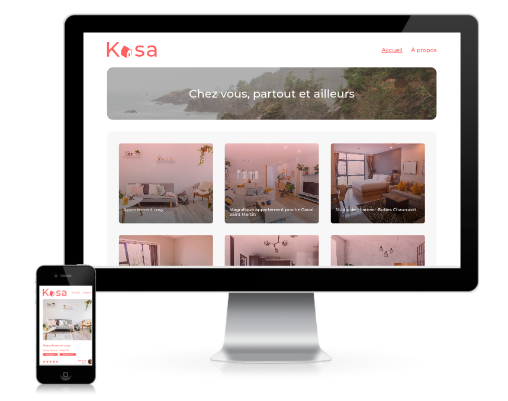

[](https://nodejs.org/)
[](https://reactjs.org/)
[](https://sass-lang.com/)

# oc-p11-Kasa 👋

This project is the n°11 in the [OpenClassrooms Front-End learning path](https://openclassrooms.com/fr/paths/516-developpeur-dapplication-javascript-react).

I am a freelance developer. My client is **Kasa**, the leader in private apartment rentals in France. I have to develop their site from models into a SPA with React and React-Router. The data are stored in a .json file (mock).

## ✨ Demo

- [Website](https://jeromeabel.github.io/oc-p11-kasa/)



## 🚨 Prerequisites

To get and build the project you will need to install :

- [NodeJS](https://nodejs.org/)
- A terminal to run commands. If you don't have one, I would recommend to use [Visual Studio Code](https://code.visualstudio.com/), it provides an integrated terminal inside the code editor.
- Optional : [Git](https://git-scm.com/)

## 🛠️ Installation

The project was created with "create-react-app"

```sh
$ npm install
```

## 🚀 Usage

```sh
$ npm run start
```

The web browser should be opened automatically at this address : http://localhost:3000/oc-p11-kasa

## 👤 Author

- [@jeromeabel](https://github.com/jeromeabel)

## 📝 License

- [GNU--GPL--3](https://www.gnu.org/licenses/gpl-3.0.fr.html)
